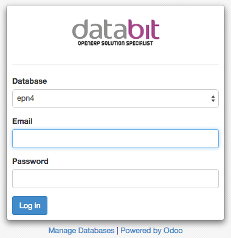
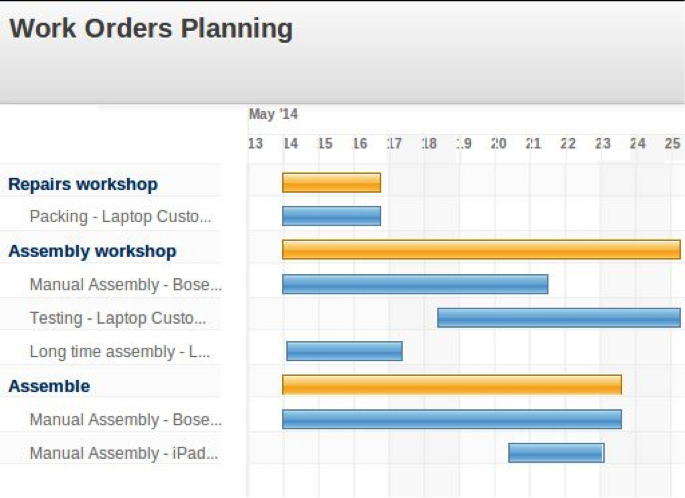

Login
=====

Untuk mengakses sistem Odoo 8, dapat dilakukan dengan menggunakan Komputer
maupun Smartphone asalkan terhubung dengan jaringan internet. Odoo bersifat web-base application,
maka untuk mengaksesnya pengguna harus menggunakan web browser seperti Chrome, Safari, Mozilla dan Internet Explorer.
Khusus untuk Internet Explorer, Odoo akan bekerja baik pada IE versi 10 keatas.

pada web browser ketik ip address atau domain Odoo Anda seperti dibawah ini

::

  www.erp.company.com:8069 atau 192.168.1.10:8069
  atau sesuai dengan settingan Sistem Administrator Anda
  
maka akan muncul tampilan sebagai berikut :

::

  Masukan Masukan User Name dan Password 
  
  
Tampilan
========

Tampilan Umum
-------------

Setelah user berhasil login ke dalam sistem, maka tampilan pertama kali yang akan muncul seperti gambar di bawah ini :

.. image:: image/tampilan_umum.png

Keterangan :
   1. Menu Utama, yang merupakan pembagian fungsi secara umum sesuai dengan kategori pekerjaan. Menu utama ini merupakan pintu masuk untuk melakukan kegiatan berikutnya.
   2. Search bar , yang merupakan area untuk melakukan pencarian sesuai yang relevan dengan fungsi dan akses dari seorang user.
   3. Pesan Umum, yang digunakan untuk mengirimkan pesan dan membaca pesan.
   4. Nama dan Foto, merupakan keterangan pengguna yang sedang login
   5. Sub Menu, merupakan turunan dari Menu Utama
   6. Working Area, tempat user bekerja dalam sistem.
   
Tampilan Form
-------------

Tampilan form digunakan untuk menampilkan data secara detail. 
seperti layaknya form pada kertas, tampilan ini digunakan untuk melakukan kegiatan 
dengan mengisi data-data yang diperlukan dalam 1 dokumen pekerjaan.

.. image:: image/form.png

Tampilan List
-------------

Tampilan List (baris), digunakan untuk melihat keseluruhan data secara urutan. Pengguna bisa mengurutkan data sesuai dengan parameter yang diinginkan dengan mengklik parameter pada judul tampilan baris.
 
.. image:: image/list_view.png

Tampilan Calendar
-----------------

Calendar View, untuk menampilkan data dalam bentuk kalender

.. image:: image/calendar.png

Tampilan Grafik
---------------

untuk menampilkan data dalam bentuk Grafik

.. image:: image/graph.png
 

Tampilan Kanban
---------------

untuk menampilkan data dalam bentuk Kanban

.. image:: image/calendar.png
 

Tampilan Gantt Chart
--------------------

untuk menampilkan data dalam bentuk Grafik Gantt

Tampilan Search
---------------

Selain mempunyai beberapa jenis view, Odoo 8 juga dilengkapi dengan fasilitas grouping dan filter yang terdapat pada search bar untuk mempermudah user dalam menganalisa data yang diinginkan.

 1. **Filter**. Fungsi Filter digunakan untuk menampilkan data yang diinginkan saja, sesuai dengan kategori yang dipilih. 
 2. **Group By**. Fungsi Group By digunakan untuk menampilkan seluruh data namun dikelompokan berdasarkan kategori yang dipilih
 3. **Custom Filter**. Berfungsi sama dengan Filter, Custom Filter menampilkan data sesuai dengan kategori yang kita inginkan, sementara fungsi Filter pada point 1, kategorinya sudah ditentukan oleh sistem.
 4. **Advance Search**. Fitur ini berfungsi untuk melakukan pencarian data dengan beberapa kategori yang diinginkan.

Untuk melakukan filtering dan grouping dapat dilihat pada gambar berikut.

