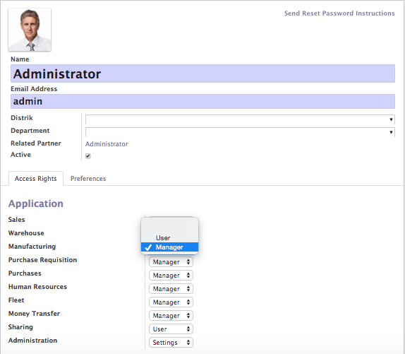
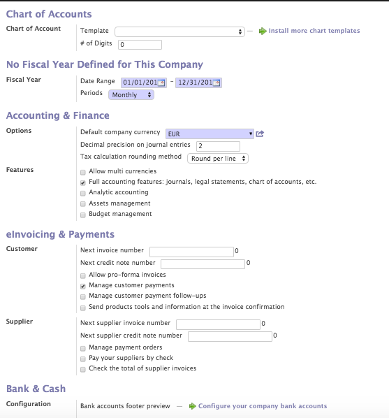

Company Setting
===============

Odoo Setting ialah bagian pertama yang akan kita bahas dalam manual guide ini.

Mari kita Mulai

Company Setting
---------------

.. note::

   Untuk Pelanggan Odoo-Databit On Demand, Company Setting akan dilakukan oleh Databit Team
   sesuai dengan data yang diterima

Untuk melakukan Company Setting dapat diakses melalui menu :

::

   Menu Settings > Companies > Companies atau klik pada logo Odoo disebelah kiri atas
   
maka akan muncul tampilan seperti ini

.. image:: image/company.png

::

   Keterangan :
    1. Isi Nama Perusahaan dan masukan logo pada field image
    2. Pada bagian General Information :
       - isi Nomor NPWP
       - kode transaksi (diisin dengan 0)
       - kode status diisi dengan 1, jika merupakan perusahaan umum
       - isi alamat perusahaan
       - isi Company Tagline dengan motto perusahaan jika ada
       - masukan informasi website perusahaan
       - isi nomor telp, fax, dan email perusahaan
    3. Pada Bagian Configuration
       - isi Currency dengan Mata Uang Dasar Perusahaan dalam hal ini : IDR

User Setting
------------

User setting digunakan untuk menambah, mengurangi atau merubah hak akses seorang pengguna.

::

   Menu Settings > Users > Users
   
Tampilan yang akan muncul seperti ini :

::

   Keterangan :
    1. Name diisi dengan Nama Users
    2. Email diisi dengan alamat email users sebagai user login
    3. Pada Bagian Configuration
       - isi Currency dengan Mata Uang Dasar Perusahaan dalam hal ini : IDR

 
.. warning:: 
   
   Pada tahap awal installasi, user akses atau group akses hanya akan terbatas pada sistem administrasi.
   User group akan muncul setelah installasi modul lainnya.
   
.. note::

   Pembuatan user group hanya bisa dilakukan oleh sistem administrator yang mengerti Odoo secara teknis.
   Bagi pelanggan Odoo-Databit On Demand, user group akan disetting sesuai dengan profile customer.

Accounting Setting
------------------

Sebelum melakukan setting accounting, hal pertama yang harus dilakukan ialah menginstall modul dos_accounting atau Accounting

::

   Menu Settings > Modules > Local Modules > dos_accounting

setelah installasi selesai, lakukan setting accounting dengan mengakses menu :

:: 
   
   Menu Settings > Configuration > Accounting
   
maka akan muncul tampilan sebagai berikut :

   
Chart of Account

::

   1. Pilih 'Indonesia - Chart of Account'
   2. Isi Sales Tax 10%
   3. Isi Purchase Tax 10%
   
.. tip::

   Chart of Account masing-masing Company dapat berbeda sesuai dengan karakter bisnis perusahaan.
   Databit menyediakan service untuk pembuatan Chat of Account.
   
No Fiscal Year Defined for This Company

::

   1. Date Range akan diisi otomatis oleh system, dengan default Januari - Desember
   2. Period : pilih Monthly 
   
Accounting & Finance

:: 

   1. Default Company Currency, pilih IDR 
   
